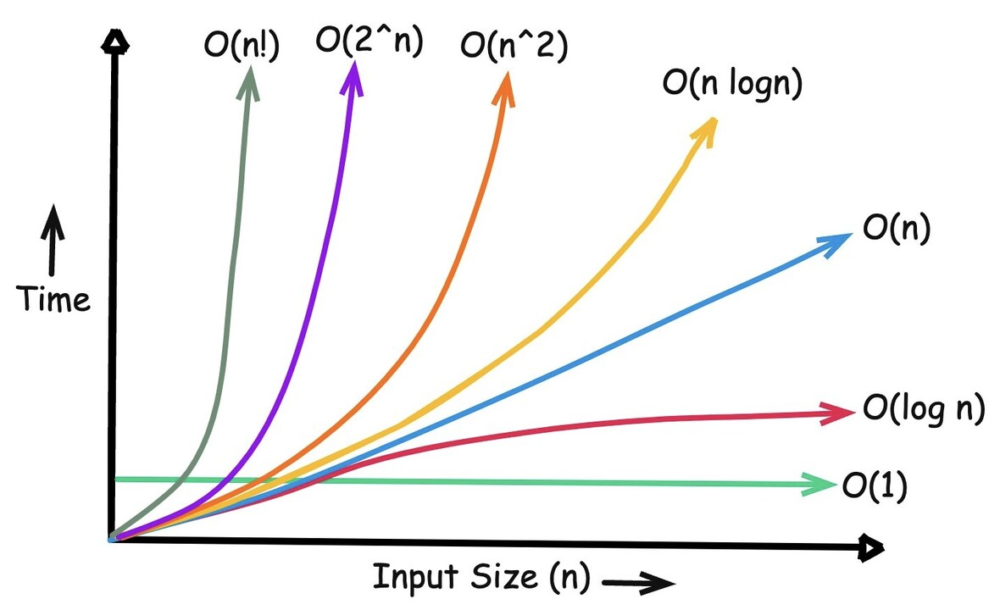

# Apa Itu Algorithm Complexity

Algorithm complexity adalah pengukuran matematis mengenai computational resources
berlandaskan time and memory yang di butuhkan algoritma untuk menyelesaikan computation,
operations etc berdasarkan inputnya biasanya di sebut `O(n)`

# Dua Jenis Utama Pengukuran Algorithm Complexity

`Time Complexity`: mengukur seberapa banyak resources yang digunakan (CPU) pada sebuah algoritma berjalan seiring bertambahnya jumlah data input

`Space Complexity`: mengukur seberapa banyak resources yang digunakan (RAM) pada sebuah algoritma berjalan seiring bertambahnya jumlah data input pada sebuah algoritma berjalan seiring bertambahnya jumlah data input

# Kapan Time Dan Space Bertambah Complexity

- `Time Complexity` bertambah jika dalam sebuah algoritma memiliki `step` yang banyak, semangkin banyak maka semangkin memakan resouce CPU
- `Space Complexity` bertambah jika dalam sebuah algoritma memiliki `memory alocation` di dalam algoritma, semangkin banyak akan memakan banyak RAM

## Space Complexity Konstan O(1) - Efisien:

Koki membuat 1.000 makanan secara bergantian. Dia hanya butuh 1 mangkok sementara yang dicuci
dan dipake ulang setelah satu makanan selesai. Sebanyak apa pun makanannya (N), meja dapur (RAM) tetap lowong karena cuma ada 1 mangkok.

> Sangat hemat memory dan mengorbankan waktu atau CPU (Time Complexity)

## Space Complexity Linear O(N) - Boros Memori:

Koki memotong bahan untuk 1.000 makanan sekaligus dan menaruh potongan setiap makanan ke mangkoknya masing-masing terlebih dahulu.
Berarti koki butuh 1.000 mangkok sementara yang memenuhi meja dapur.
Jika pesanan bertambah jadi 10.000, meja dapur (RAM) akan penuh sesak dan kehabisan tempat (Out of Memory).

> Sangat hemat waktu dan mengorbankan memory (Space Complexity)

---

## Time-Space Trade-Off in Algorithms

"A tradeoff is a situation where one thing increases and another thing decreases. It is a way to solve a problem in:
Either in less time and by using more space, or
In very little space by spending a long amount of time."

> https://www.geeksforgeeks.org/dsa/time-space-trade-off-in-algorithms/

# Understanding Big O Notation In Programming

#### 1. O(1) Constant Time

> Time Complexity : O(1)
> space Complexity : O(1)

```python
data = [1, 2, 3, 4, 5, 6, 7]

print(data[2])
```

Code di atas sangat simple dan mudah dipahami, tetapi di balik itu banyak hal yang orang yang tidak mengerti cara kerja secara low-level-nya.
pada deklarasi variable array of integer, sebenarnya data tersebut benar benar di simpan pada sebuah contiguous memory (memory yang berurutan),

> Mengapa disebut `O(1)`? Karena komputer bisa langsung menghitung lokasi memori target secara instan
> menggunakan rumus indeks tanpa harus melakukan looping (perulangan) atau comparison (perbandingan) sama sekali.
> Itulah mengapa ini dikatakan sebagai complexity tercepat.

#### 2. O(n) Linear Time

> Time Complexity : O(n)
> space Complexity : O(1)

```python
data = [1, 3, 6, 7, 9, 2, 4, 5, 7, 0]
target = 5

for value in data:
  if value == target:
    print("Found!")
```

Berbeda dengan `O(1)` di mana kita tahu lokasi pasti sebuah data lewat indeks,
pada `O(n)` kita harus mencari data secara manual.
Code di atas menggunakan looping untuk mengeliminasi array of integer dari awal sampai akhir demi menemukan nilai target.
Oleh karena itu, kecepatan algoritma ini dikatakan `O(n)` karena performanya berbanding lurus (linier) dengan jumlah data input `n`.
Semakin banyak data yang dimasukkan, semakin banyak pula operasi pencarian yang harus dilakukan komputer.

> Jika datanya ada 1 juta, maka skenario terburuknya (worst-case) komputer harus melakukan 1 juta kali pengecekan.
> dan juga algoritma ini dapat di bilang memiliki ke unggulan jika data tidak sorted atau urut dia akan tetap menemukan datanya

#### 3. O(n²) Quadratic Time

> Time Complexity : O(n²)
> space Complexity : O(1)

```python
data = [1, 2, 3, 4]

def duplicate(data):
  for i in range(len(data)):
    for j in range(i + 1, len(data)):
      if data[i] == data[j]:
        return "data is duplicated"

  return "data is not duplicated"
```

Jika pada `O(n)` kita hanya melakukan satu kali operan looping, pada `O(n²)` atau Quadratic Time kita melakukan perulangan di dalam perulangan (nested loop).
Perhatikan fungsi pengecekan duplikat di atas. Untuk setiap elemen i, komputer harus berputar lagi melakukan looping j untuk mengecek elemen-elemen setelahnya.
Artinya, jika kita memiliki data sebesar `n`, komputer akan melakukan operasi sekitar `n` times `n` (alias `n²`).Jika datanya hanya 5,
operasinya masih kecil, yaitu sekitar 25 operasi. Namun,

> jika datanya membengkak menjadi 10.000,
> jumlah operasinya akan melesat tajam menjadi 100.000.000 (100 juta) operasi.
> Algoritma ini biasanya terjadi ketika kita harus membandingkan setiap elemen dengan setiap elemen lainnya di dalam satu collection
> Performanya akan menurun sangat drastis seiring bertambahnya data, sehingga sangat dihindari untuk scale data yang besar.

#### 4. O(log n) Logarithmic Time

> Time Complexity : O(log n)
> space Complexity : O(1)

```python
data = [1, 3, 5, 7, 9, 11, 13, 15]

def binary_search(data, target):
    left = 0
    right = len(data) - 1

    while left <= right:
        mid = (left + right) // 2

        if data[mid] == target:
            return mid

        if data[mid] < target:
            left = mid + 1
        else:
            right = mid - 1

    return -1

print(binary_search(data, 11))
```

Algoritma binary search menggunakan konsep "divide and conquer" (membagi data menjadi setengah setiap langkah),
algoritma ini dapat di gunakan jika data sudah jelas sorted sudah pasti urut dan algoritma ini adalah optimasi dari `O(n)`,
dari pada kita melakukan pengecekan data satu persatu di setiap data yg ada sejumlah `n`,
kita lansung membandingkan data dengan data yg berada di tengah `(mid)`,
Jika nilai tengahnya lebih kecil atau lebih besar dari target, kita bisa langsung membuang setengah sisa data yang tidak relevan.
Perhatikan variabel `data` pada code di atas yang memiliki 8 elemen. Jika kita mencari angka 11:

- Langkah 1: Tebak nilai tengah (angka 7). Karena 7 < 11, buang semua data di sebelah kiri 7. Sisa data: [9, 11, 13, 15].
- Langkah 2: Tebak nilai tengah baru (angka 11 atau 13). Data langsung ditemukan hanya dalam 2-3 langkah

> Secara matematis, jumlah operasi yang dilakukan adalah kebalikan dari eksponensial `(log n)`. Jika kita punya 1 juta data,
> O(n) butuh 1 juta operasi, sedangkan O(log n) hanya butuh maksimal sekitar 20 operasi.

#### 5. O(n log n) Linearithmic Time

> Time Complexity : O(n log n)
> space Complexity : O(n)

```python
def merge_sort(arr):
    if len(arr) <= 1:
        return arr

    mid = len(arr) // 2

    left = merge_sort(arr[:mid])
    right = merge_sort(arr[mid:])

    result = []

    i = j = 0

    while i < len(left) and j < len(right):
        if left[i] < right[j]:
            result.append(left[i])
            i += 1
        else:
            result.append(right[j])
            j += 1

    result.extend(left[i:])
    result.extend(right[j:])

    return result


numbers = [5, 2, 7, 1, 9, 4]

print(merge_sort(numbers))
```

#### 6. O(2ⁿ)

> Time Complexity : O(2ⁿ)
> space Complexity : O(n)

```python
def fibonacci(n):
    if n <= 1:
        return n

    return fibonacci(n - 1) + fibonacci(n - 2)


print(fibonacci(10))
```

#### 7. O(n!) Factorial Time

> Time Complexity : O(n!)
> space Complexity : O(n²)

```python
def permute(nums, current=[]):
    if not nums:
        print(current)
        return

    for i in range(len(nums)):
        permute(
            nums[:i] + nums[i + 1:],
            current + [nums[i]]
        )


permute([1, 2, 3])
```

## Summary Table

| Big O          | Common Example            | Typical Use Case      |
| -------------- | ------------------------- | --------------------- |
| **O(1)**       | Array indexing            | Direct access         |
| **O(log n)**   | Binary Search             | Searching sorted data |
| **O(n)**       | Linear Search             | Scanning a list       |
| **O(n log n)** | Merge Sort, Heap Sort     | Efficient sorting     |
| **O(n²)**      | Bubble Sort, nested loops | Comparing every pair  |
| **O(2ⁿ)**      | Recursive Fibonacci       | Brute-force recursion |
| **O(n!)**      | Permutations              | Backtracking problems |

## Big O Notation Grap


[image source](https://www.linkedin.com/pulse/big-o-notation-its-significance-llms-tarry-singh-vizxc/)
