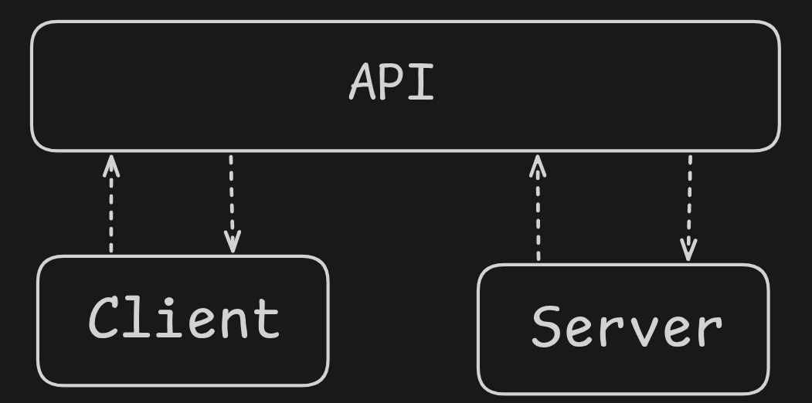

## Apa Itu Backend?
Backend adalah bagian dari aplikasi yang berjalan di sisi server side dan bertugas untuk mengelola data, logic, dan proses di balik layar.
Ketika kamu menggunakan aplikasi web dan lain sebagainya, sebenarnya kamu sedang berkomunikasi dengan backend.
Di artikel ini, kita akan fokus membahas salah satu jenis API yang paling populer, yaitu REST API.

Contoh sederhana:
- Kamu login → backend mengecek username & password
- Kamu lihat data → backend mengambil data dari database
- Kamu upload foto → backend menyimpan file tersebut

Singkatnya:
- **Frontend** = yang dilihat user
- **Backend** = yang bekerja di balik layar

---

## Apa Itu API?
API (Application Programming Interface) adalah jembatan komunikasi antara client dan server.
API memungkinkan frontend dan backend saling bertukar data.

Contoh:
- Frontend minta data user → lewat API
- Backend kirim data → lewat API

Tanpa API, frontend tidak bisa berkomunikasi dengan backend.
 

---

## Jenis-Jenis API Architecture & Protocol
Ada beberapa pendekatan yang umum digunakan dalam membangun API:

#### 1. RESTful API
Menggunakan HTTP dan berbasis resource. Ini adalah pendekatan paling populer dalam pengembangan web modern.
#### 2. GraphQL
Client dapat menentukan data apa saja yang ingin diambil, sehingga lebih fleksibel dibanding REST.
#### 3. SOAP
Protocol berbasis XML dengan aturan yang ketat, biasanya digunakan pada sistem enterprise.
#### 4. gRPC
Protocol modern yang menggunakan HTTP/2 dan Protobuf, dikenal cepat dan efisien.
#### 5. WebSocket
Protocol untuk komunikasi real-time antara client dan server (dua arah / full-duplex).

Perbedaan utama dari masing-masing pendekatan ini terletak pada cara komunikasi, format data, dan kebutuhan.
Namun, dari semua itu, **REST API adalah yang paling banyak digunakan dalam pengembangan web modern, sehingga kita akan fokus ke sana.**

---

## Apa Itu REST API?
Setelah memahami peran backend dan API, sekarang kita masuk ke konsep yang paling sering digunakan dalam pengembangan web, yaitu REST API.
REST API (Representational State Transfer Application Programming Interface) adalah cara komunikasi antara client dan server menggunakan protokol HTTP, yang berjalan di atas `TCP/IP`,
Ketika terjadi sebuah komunikasi pasti di situ terjadi pertukaran informasi antar client dan server,
informasi tersebut di sebut dengan data

---

## Cara Kerja REST API
REST API bekerja menggunakan protokol HTTP, di mana client mengirim request dan server memberikan response.

### Request dan Response
- **Request** → permintaan dari client ke server  
- **Response** → jawaban dari server ke client  

### Contoh Sederhana
#### Request (client)
    GET /users
    Content-Type: application/json
#### Response (server)
    200 OK
    Content-Type: application/json
```json
[
  {
    "id": 1,
    "name": "Ahmad"
  }
]
```

---

## Struktur HTTP Request & Response
Dalam REST API, data dikirim melalui HTTP yang memiliki dua bagian utama:

#### 1. Header
Header berisi informasi tambahan tentang request atau response.
Contoh:
- Content-Type → format data yang dikirim
- Accept → format data yang diharapkan

#### 2. Body
Body adalah tempat data utama dikirim.
Contoh:
Saat login, username & password dikirim di bagian body.

---

## Format Data dalam REST API
REST API tidak membatasi format data tertentu. Namun, ada beberapa format yang umum digunakan:
- JSON (paling umum)
- XML (lebih jarang, biasanya di sistem lama)
Di antara semua format tersebut, JSON adalah yang paling sering digunakan dalam pengembangan web modern.

Contoh response JSON:
```json
{
  "id": 1,
  "name": "Ahmad"
}
```
Contoh response XML:
```xml
<user>
  <id>1</id>
  <name>Ahmad</name>
</user>
```

Format data ditentukan melalui header HTTP, seperti:
Content-Type dan Accept
```http
Content-Type: application/json
Accept: application/json
```

### Perbandingan singkat JSON VS XML
| Aspek        | JSON               | XML                         |
|--------------|--------------------|------------------------------|
| Format       | Ringan & simpel    | Lebih verbose (panjang)      |
| Readability  | Mudah dibaca       | Lebih kompleks               |
| Ukuran       | Lebih kecil        | Lebih besar                  |
| Parsing      | Cepat              | Lebih lambat                 |
| Penggunaan   | Modern Web API     | Sistem lama / enterprise     |

Alasan utama kenapa XML mulai di tinggalkan karena XML memiliki ukuran yang lebih besar di banding JSON dengan
ukuran yang lebih kecil performa jadi lebih cepat dan juga tidak memakan banyak bandwidth

---

### Penamaan sebuah endpoint / url
Endpoint adalah alamat (URL) yang digunakan untuk mengakses resource di server melalui REST API.
Dalam REST API, endpoint harus merepresentasikan **resource (data)**, bukan aksi.

Contoh:
```http
GET /products
GET /product/1
POST /product
```

Penamaan endpoint yang baik:
- gunakan kata benda (noun), bukan kata kerja
- Gunakan Bentuk Jamak (Plural)
- contoh yang benar: `/products`
- contoh yang kurang baik: `/getAllProducts`

### Penggunaan Dasar HTTP Method
- `GET` : mengambil data dari server
- `POST` : mengirim atau membuat data baru
- `PUT` : memperbarui seluruh data (replace)
- `PATCH` : memperbarui sebagian data
- `DELETE` : menghapus data
- `OPTIONS` : mengetahui method apa saja yang didukung oleh endpoint
- `HEAD` : mengambil informasi header tanpa body response
- `TRACE` : melihat jejak request (jarang digunakan)

Biasanya paling banyak digunakan HTTP Method yaitu hanya `GET POST PUT PACTH dan DELETE`
Reverensi lebih lengkap [disini](https://developer.mozilla.org/en-US/docs/Web/HTTP/Reference/Methods)

### Status Code
status code adalah sebuah kode dimana kode tersebut menunjukan sebuah hasil dari request yang masuk,
bisa di kataan sebuah kode response dari server ke client

### Status Code
Status code adalah kode yang menunjukkan hasil dari request yang dikirim oleh client ke server.

#### Status Code Berdasarkan Kategori
- `1xx` : proses
- `2xx` : sukses
- `3xx` : redirect
- `4xx` : kesalahan di client
- `5xx` : kesalahan di server

#### HTTP Status Code yang Umum Digunakan
##### Success (2xx)
- `200 OK` : Request berhasil (GET, PUT, PATCH)
- `201 Created` : Data berhasil dibuat (POST)
- `204 No Content` : Berhasil tanpa response body (DELETE)

##### Client Error (4xx)
- `400 Bad Request` : Request tidak valid (input salah)
- `401 Unauthorized` : Belum login / token tidak ada
- `403 Forbidden` : Tidak punya akses
- `404 Not Found` : Data tidak ditemukan
- `422 Unprocessable Entity` : Validasi gagal

##### Server Error (5xx)
- `500 Internal Server Error` : Error di server
- `502 Bad Gateway` : Server lain error
- `503 Service Unavailable` : Server sedang down / maintenance

#### Referensi
https://developer.mozilla.org/en-US/docs/Web/HTTP/Reference/Status

---

### Prinsip Dasar REST API
REST API tidak hanya sekadar menggunakan HTTP, tetapi juga memiliki beberapa prinsip atau aturan yang menjadi standar dalam perancangannya.
Berikut beberapa prinsip utama dalam REST API:

### 1. Stateless
Setiap request dari client ke server harus berdiri sendiri (tidak saling bergantung).

Artinya:
Server tidak menyimpan state (status) dari request sebelumnya.

Contoh:
Saat login, client harus mengirim token di setiap request, karena server tidak menyimpan sesi.

### 2. Client-Server
Client dan server dipisahkan dengan jelas.

- Client → mengatur tampilan (UI)
- Server → mengelola data dan logic

Tujuannya agar pengembangan lebih fleksibel dan terstruktur.

### 3. Cacheable
Response dari server bisa disimpan (cache) oleh client.

Tujuannya:
- Mengurangi beban server
- Mempercepat response

Contoh:
Data yang jarang berubah bisa di-cache di browser.

### 4. Uniform Interface
REST API harus memiliki struktur yang konsisten.

Contoh:
- Endpoint menggunakan noun → `/users`
- Menggunakan HTTP method dengan benar (GET, POST, dll)

Ini membuat API mudah dipahami dan digunakan.

### 5. Layered System
Arsitektur REST bisa terdiri dari beberapa layer (lapisan).

Contoh:
Client → API Gateway → Server → Database

Client tidak perlu tahu langsung struktur di dalam server.

### 6. Code on Demand (Opsional)
Server bisa mengirim kode ke client untuk dijalankan (jarang digunakan).

Contoh:
JavaScript yang dikirim dari server ke browser.
